# Gosling - Model Context Protocol (MCP) Server

A modular, production-ready Golang **Model Context Protocol (MCP)** Server built with **Domain-Driven Design (DDD)** and **Clean / Onion Architecture**. Powered by the official [`github.com/modelcontextprotocol/go-sdk/mcp`](https://github.com/modelcontextprotocol/go-sdk) package and Google GenAI SDK (Gemini).

Gosling exposes rich LLM generation tools, prompts, resources, authentication, and persistence over all standard MCP transport mechanisms:
- **JSON-RPC 2.0 Stdio Transport**: Standard I/O communication for Claude Desktop, Cursor, and CLI agent tools.
- **Streamable HTTP Transport**: Modern HTTP POST/GET transport on `/mcp`.
- **Server-Sent Events (SSE) Transport**: Real-time event-streaming transport on `/sse`.

---

## Table of Contents
1. [Quickstart & First Run](#1-quickstart--first-run)
   - [Running with Go (HTTP / SSE / Streamable)](#running-with-go-http--sse--streamable)
   - [Running in JSON-RPC 2.0 Stdio Mode](#running-in-json-rpc-20-stdio-mode)
   - [Running with Docker Compose](#running-with-docker-compose)
2. [Example Go Client](#2-example-go-client)
3. [MCP Capabilities Reference](#3-mcp-capabilities-reference)
   - [MCP Tools Catalog](#mcp-tools-catalog)
   - [MCP Prompts Catalog](#mcp-prompts-catalog)
   - [MCP Resources & Templates](#mcp-resources--templates)
4. [Connecting to AI Hosts (Claude Desktop / Cursor)](#4-connecting-to-ai-hosts-claude-desktop--cursor)
5. [Architecture & Clean Design](#5-architecture--clean-design)
6. [Automated Testing](#6-automated-testing)
7. [Environment Variables](#7-environment-variables)

---

## 1. Quickstart & First Run

### Prerequisites
- [Go 1.24+](https://go.dev/dl/) installed.
- A **Google Gemini API Key** (obtain free from [Google AI Studio](https://aistudio.google.com)).
- *(Optional)* [Docker](https://docs.docker.com/get-docker/) & PostgreSQL if database history persistence is enabled.

---

### Running with Go (HTTP / SSE / Streamable)

1. Copy and configure environment variables:
```bash
cp .env.example .env
```
Set `GEMINI_API_KEY` in `.env`:
```env
GEMINI_API_KEY=AIzaSyYourGoogleGeminiApiKeyHere
```

2. Start the MCP Server:
```bash
make run
# or
go run cmd/server/main.go
```
The server starts listening on `http://0.0.0.0:8080` with the following endpoints:
- **Streamable HTTP**: `http://localhost:8080/mcp`
- **Server-Sent Events (SSE)**: `http://localhost:8080/sse`
- **Health Check**: `http://localhost:8080/health`

---

### Running in JSON-RPC 2.0 Stdio Mode

For direct CLI agent integration (e.g. Claude Desktop, Cursor, custom subagents):
```bash
make run-stdio
# or
go run cmd/server/main.go --stdio
```

---

### Running with Docker Compose

Start both PostgreSQL and the Gosling MCP server in isolated containers:
```bash
make docker-up
```
Stop containers:
```bash
make docker-down
```

---

## 2. Example Go Client

Gosling includes a sample MCP client written in Go located at [`examples/go-client`](file:///examples/go-client).

### Run with Streamable HTTP (Default)
```bash
go run examples/go-client/main.go -transport=streamable -url=http://localhost:8080/mcp
```

### Run with Server-Sent Events (SSE)
```bash
go run examples/go-client/main.go -transport=sse -url=http://localhost:8080/sse
```

### Run with JSON-RPC 2.0 Stdio
```bash
go run examples/go-client/main.go -transport=stdio -cmd="go run ./cmd/server/main.go --stdio"
```

### Interactive REPL Chat Session
```bash
go run examples/go-client/main.go -transport=streamable -interactive
```

---

## 3. MCP Capabilities Reference

### MCP Tools Catalog

| Tool Name | Description | Key Parameters |
| :--- | :--- | :--- |
| `chat` | Generates responses using Google Gemini LLMs. Supports multi-turn messages, system instruction, temperature, token limits, and optional user attribution. | `prompt`, `messages`, `model`, `system_instruction`, `temperature`, `max_output_tokens`, `auth_token`, `user_id` |
| `get_available_models` | Lists all supported Gemini LLM model names and default model. | *(None)* |
| `get_chat_history` | Retrieves conversation history logs for a user. | `user_id`, `auth_token`, `limit` |
| `verify_google_id_token` | Authenticates or implicitly registers a user via Google ID Token. Returns JWT access token and user profile. | `id_token` (required) |
| `login_with_google_code` | Authenticates or implicitly registers a user via Google OAuth authorization code. | `code` (required) |
| `get_google_auth_url` | Generates the Google OAuth2 consent screen URL. | `state` (optional) |
| `get_user_profile` | Retrieves user profile details by User UUID or JWT Auth Token. | `user_id`, `auth_token` |
| `health_check` | Returns operational health, version, and supported MCP transports. | *(None)* |

#### Tool Call Example (`chat`):
```json
{
  "name": "chat",
  "arguments": {
    "model": "gemini-2.5-flash",
    "prompt": "Explain Domain-Driven Design in 3 concise bullet points.",
    "temperature": 0.7
  }
}
```

---

### MCP Prompts Catalog

| Prompt Name | Description | Arguments |
| :--- | :--- | :--- |
| `gosling_chat` | General conversational assistant and reasoning template. | `task` (required), `context`, `system_instruction` |
| `code_assistant` | Specialized software development and code generation template. | `task` (required), `language`, `framework` |
| `system_architect` | Domain-Driven Design & distributed systems architecture design prompt. | `requirements` (required), `patterns` |

---

### MCP Resources & Templates

| URI / Template | MIME Type | Description |
| :--- | :--- | :--- |
| `gosling://models` | `application/json` | Available and recommended Gemini LLM models. |
| `gosling://system/health` | `application/json` | System health status, version, and active transports. |
| `gosling://users/{user_id}/profile` | `application/json` | User account profile by user UUID. |
| `gosling://users/{user_id}/history` | `application/json` | User chat conversation history by user UUID. |

---

## 4. Connecting to AI Hosts (Claude Desktop / Cursor)

To use Gosling as an MCP Server with **Claude Desktop**, add the following entry to your `claude_desktop_config.json`:

```json
{
  "mcpServers": {
    "gosling": {
      "command": "/absolute/path/to/gosling/bin/gosling-mcp-server",
      "args": ["--stdio"],
      "env": {
        "GEMINI_API_KEY": "AIzaSyYourGoogleGeminiApiKeyHere",
        "GEMINI_DEFAULT_MODEL": "gemini-2.5-flash"
      }
    }
  }
}
```

Or connect via Streamable HTTP / SSE in modern MCP clients:
- **Streamable HTTP URL**: `http://localhost:8080/mcp`
- **SSE URL**: `http://localhost:8080/sse`

---

## 5. Architecture & Clean Design

Gosling follows **Domain-Driven Design (DDD)** and **Clean / Onion Architecture**:

```mermaid
flowchart TD
    subgraph Presentation_Layer["1. Delivery / Presentation Layer (MCP)"]
        MCP_Server["MCPServer (github.com/modelcontextprotocol/go-sdk/mcp)"]
        T_Chat["Tool: chat, get_available_models, get_chat_history"]
        T_Auth["Tool: verify_google_id_token, login_with_google_code, get_user_profile"]
        T_Sys["Tool: health_check"]
        P_Prompts["Prompts: gosling_chat, code_assistant, system_architect"]
        R_Res["Resources: gosling://models, gosling://system/health, gosling://users/..."]
        H_Transports["Transports: JSON-RPC 2.0 Stdio, Streamable HTTP (/mcp), SSE (/sse)"]
    end

    subgraph Application_Layer["2. Application / Use Case Layer"]
        UC_Auth["AuthUseCase\n- LoginWithGoogleIDToken\n- ImplicitRegister\n- TokenGeneration"]
        UC_Chat["ChatUseCase\n- SendMessage\n- ModelSelection\n- HistoryPersistence"]
    end

    subgraph Domain_Layer["3. Core Domain Layer (Zero External Dependencies)"]
        E_User["User Entity"]
        E_Chat["Chat & Message Entities"]
        P_UserRepo[("UserRepository Port")]
        P_ChatRepo[("ChatRepository Port")]
        P_GoogleAuth[("GoogleAuthVerifier Port")]
        P_TokenSvc[("TokenService Port")]
        P_LLMSvc[("LLMService Port")]
    end

    subgraph Infrastructure_Layer["4. Infrastructure Layer (Adapters)"]
        I_PG_User["Postgres UserRepository"]
        I_PG_Chat["Postgres ChatRepository"]
        I_JWT["JWT Token Service"]
        I_Google["Google OAuth / IDToken Adapter"]
        I_GenAI["Google GenAI SDK Adapter (Gemini)"]
        I_DB[("PostgreSQL Database")]
    end

    %% Presentation to Use Case
    MCP_Server --> UC_Auth
    MCP_Server --> UC_Chat

    %% Use Case to Domain Ports
    UC_Auth --> P_UserRepo
    UC_Auth --> P_GoogleAuth
    UC_Auth --> P_TokenSvc
    UC_Chat --> P_LLMSvc
    UC_Chat --> P_ChatRepo

    %% Infrastructure implements Domain Ports (Dependency Inversion)
    I_PG_User -.->|implements| P_UserRepo
    I_PG_Chat -.->|implements| P_ChatRepo
    I_JWT -.->|implements| P_TokenSvc
    I_Google -.->|implements| P_GoogleAuth
    I_GenAI -.->|implements| P_LLMSvc

    %% Infrastructure DB links
    I_PG_User --> I_DB
    I_PG_Chat --> I_DB
```



---

## 6. Automated Testing

Run the full suite of unit and integration tests (including MCP tool invocation, schema validation, prompt generation, resource reading, Streamable HTTP, and SSE transport tests):

```bash
make test
# or
go test -v -race ./...
```

---

## 7. Environment Variables

| Variable | Default | Description |
| :--- | :--- | :--- |
| `APP_NAME` | `gosling-mcp-server` | MCP Server application name. |
| `APP_VERSION` | `1.0.0` | MCP Server version. |
| `APP_ENV` | `development` | Environment mode (`development` or `production`). |
| `PORT` | `8080` | Port for HTTP server (Streamable HTTP `/mcp` & SSE `/sse`). |
| `MCP_TRANSPORT` | `http` | Transport mode (`http` for streamable/sse or `stdio` for CLI). |
| `GEMINI_API_KEY` | `""` | Google GenAI API Key for Gemini models. |
| `GEMINI_DEFAULT_MODEL` | `gemini-2.5-flash` | Default Gemini model used for LLM tasks. |
| `DB_HOST` | `localhost` (`postgres` in Docker) | PostgreSQL host. |
| `DB_PORT` | `5432` | PostgreSQL port. |
| `DB_USER` | `postgres` | PostgreSQL username. |
| `DB_PASSWORD` | `postgres` | PostgreSQL password. |
| `DB_NAME` | `gosling_db` | PostgreSQL database name. |
| `DB_SSLMODE` | `disable` | SSL mode (`disable`, `require`, `verify-full`). |
| `JWT_SECRET` | `super-secret...` | Secret key for signing HMAC-SHA256 JWT tokens. |
| `JWT_EXPIRY_HOURS` | `72` | Token validity duration in hours. |
| `GOOGLE_CLIENT_ID` | `""` | Google OAuth 2.0 Client ID. |
| `GOOGLE_CLIENT_SECRET` | `""` | Google OAuth 2.0 Client Secret. |
| `ALLOWED_ORIGINS` | `*` | Allowed CORS origins. |

---

## License
MIT License. Free for open-source and commercial use.
